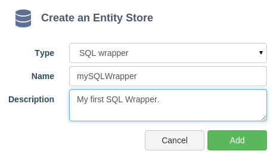
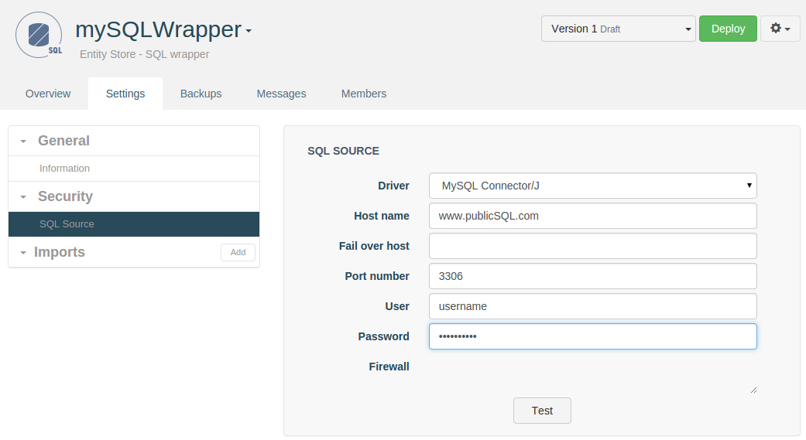
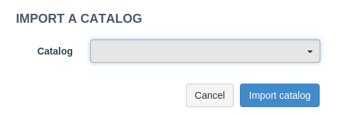
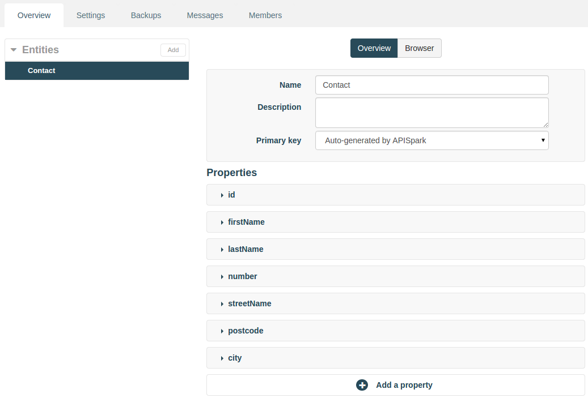
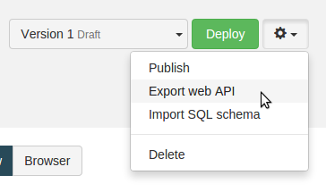
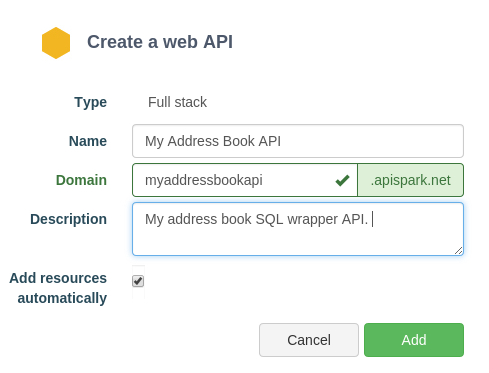
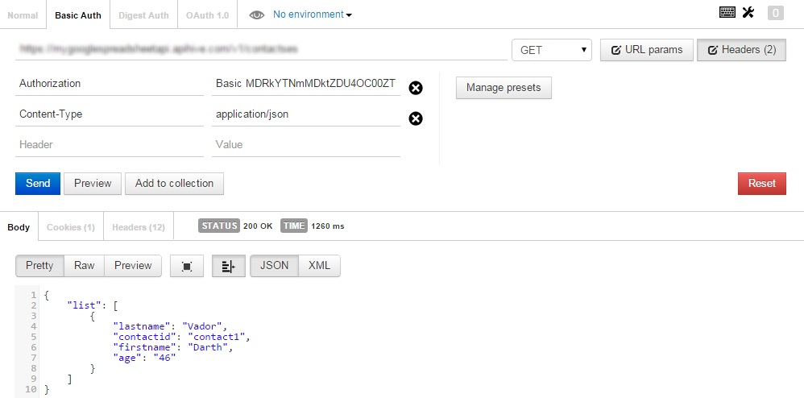

# Introduction

This tutorial will show you how to create a custom web API that exposes data stored in an Address Book SQL database.

# Requirements

To follow this tutorial, you will need:

*   a web browser,
*   20 minutes of your time,
*   your SQL database login details.

# 1. Prepare the SQL Data Source

In this tutorial example, we create an SQL table named **T_ADDRESS** with the following fields :

<li>**ID** (varchar): primary key</li>
<li>**FIRST_NAME** (varchar): first name</li>
<li>**LAST_NAME** (varchar): last name</li>
<li>**NUMBER** (int): street number</li>
<li>**STREET_NAME** (varchar): street name</li>
<li>**POSTCODE** (varchar): postcode</li>
<li>**CITY** (varchar): city</li>

Connect the database engine using the MySQL console:

<pre>$ mysql -u root -p</pre>

Create a database and switch to it:

<pre>mysql> create database apispark;
Query OK, 1 row affected (0.01 sec)
mysql> use apispark;
Database changed</pre>

Create an InnoDB table named T_ADDRESS with fields previously listed:

<pre>CREATE TABLE T_CONTACT (
	  ID VARCHAR(255),
	  FIRST_NAME VARCHAR (255),
	  LAST_NAME VARCHAR (255),
	  NUMBER INT,
	  STREET_NAME VARCHAR (255),
	  POSTCODE VARCHAR (255),
	  CITY VARCHAR (255),
	  PRIMARY KEY(ID)
	) ENGINE = InnoDB;
</pre>

Create a new user and grant him full rights on the database. Replace username and password by the values you like:

<pre>CREATE USER 'username'@'%' IDENTIFIED BY "password";
GRANT ALL PRIVILEGES on apispark.T_CONTACT TO 'username'@'%';
FLUSH PRIVILEGES;
</pre>

>**Note:** you can grant privileges on all tables by replacing T_ADDRESS by \* and
on all databases by replacing apispark by \*.

# 2. Create an SQL Wrapper

## 2.1 Create a new SQL Wrapper

If you haven't already done so, [sign in](https://apispark.com/signin) to your APISpark account and open your **Dashboard**.

Create a new Entity Store. Click on **+ Entity Store**, select the "SQL Wrapper" **Type** and enter the **Name** "mySQLWrapper".

Input a description if you wish.

Click on **Add** to create the Wrapper. You will be taken to the Wrapper's **Overview**.

## 2.2 Configure Wrapper security settings

Click on the **Settings** tab.

In the **Security** drop down, click on **SQL Source**.

Select the **Driver** (database type) and input the **Host name**, **Port number**, **Username** and **Password**.

Click on the **Test** button to test the connection.

>**Note:** you need to make sure that the APISpark IP addresses indicated in the Firewall field are authorized to access your database from the internet.

## 2.3 Import a Catalog

From the **Settings tab**, click on **Import a catalog**.

The catalog list contains all the databases visible by the specified user. Select the **Catalog** you wish to import and click on the **Import catalog** button.

Under the **Imports** dropdown, click on the **Catalog** you selected. It will open its **Overview** tab.

Next, click on the **Entities** tab.

Click on the **Add entities** button.

This automatically creates entities based on the imported tables. APISpark automatically renames the entities and their properties during this operation.

Our entity store now contains an **Entity** called **Contact**.

The **Contact** entity’s properties correspond to the columns present in the matching database table.

# 2.4 Deploy the SQL Wrapper

Click on the **Deploy** button to deploy the Wrapper.

# 3. Export a Web API

From the Wrapper's **Overview** page, click on the actions button on the right of the **Deploy** button and select **Export web API**.

Give your new API a name. We named ours **My Address Book API**.

The domain will be created automatically but may not be available anymore so make sure to adjust it.

Click on **Add** to create the API. You will be taken to the API's **Overview** page.

Deploy the API by clicking the **Deploy** button.

# 4. Invoke the Web API

Using a web API does not impose any particular programming language. It can even be done from a web browser. However, to test your API we recommend the use of tools such as the Chrome extensions POSTMAN and DHC that provide a graphical user interface to perform HTTP calls.
The following figure shows the call to the Contacts API with POSTMAN.

The credentials required to invoke the API can be found in the **Overview** tab, by clicking on the relevant **Endpoint**. You will need to copy the **Endpoint URI**, **Login** and **Password** information for the next step.

When using POSTMAN, click on the **Basic Auth** tab, fill in the **Username** and **Password** fields with the information copied from your APISpark **Endpoint**. Fill in the **Endpoint URI** and add **/contacts/** at the end of it.

Click the **Send** button.

The following figure shows the API call in POSTMAN.

Any POST requests made to the API will result in new data being created in your SQL database. Likewise, any data manually inserted via your SQL DBMS is visible via the custom web API.

>**Note:** APISpark lets you generate custom Client SDKs for you API. Supported environments include Java, Android, GWT and JavaScript (AJAX or Node.js).

Congratulations on completing this tutorial! If you have questions or suggestions, feel free to contact the [Help Desk](http://support.apispark.com/).
