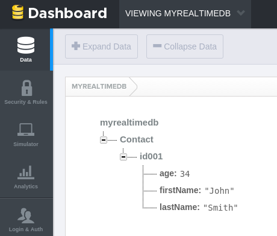
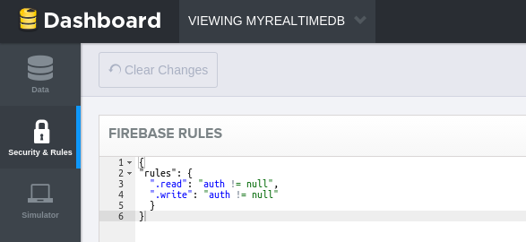
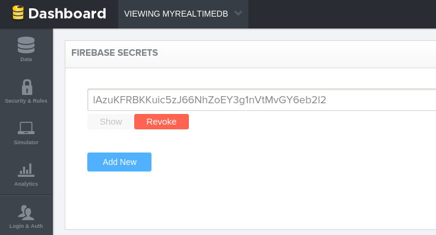
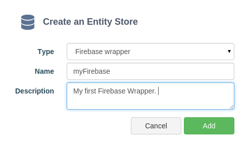
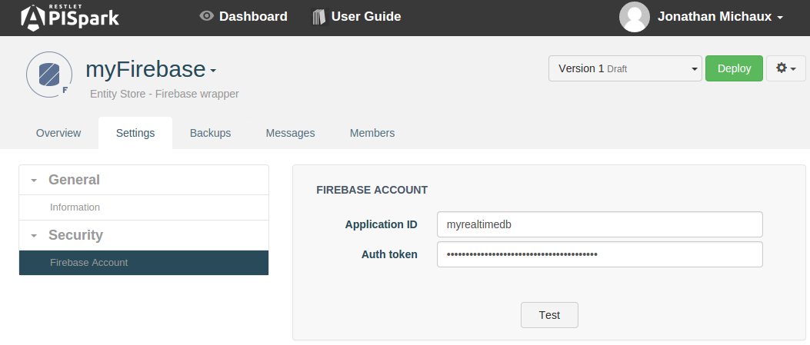

# Introduction

This tutorial will show you how to create a custom web API that gives access to existing data stored in a Firebase backend. <a href="https://www.firebase.com" target="_blank">Firebase</a> is a popular Backend as a Service (BaaS) provider that powers real time HTML 5 applications.

# Requirements

To follow this tutorial, you will need:

*   a web browser,
*   20 minutes of your time,
*   Your Firebase login details.

# 1. Prepare the Firebase Backend

## 1.1 Create a new Firebase

Sign in to your **Firebase** account. Select the application you want to work on, or create a new one. For this tutorial, we created a new app called **MyRealtimeDB**, and with app URL **myrealtimedb**. You may need to edit the app URL if it is already taken.

After clicking on **CREATE NEW APP**, you will be directed to the app's data console. The default root data element in this app will be named after your app URL.

Now, enter a sample **Contact** by matching the tree structure illustrated in the screenshot below. Begin by adding a **Contact** element. Add a child element that will be used as the **Contact**'s ID. Then add the following fields below the ID:
*   **lastName** (string: value in quotes)
*   **firstName** (string: value in quotes)
*   **age** (integer: without quotes)

We recommend manually adding a data element to your FireBase so that you can retrieve it later, but this is not mandatory.

As you can see, we have chosen to name our **Contact** John Smith, age 34 years old, and to give him the ID id001.

Be aware that the structure of this data will be reflected in APISpark later, namely:

*   the entity name (Contact here)
*   the entity identifier
*   the entity's properties

## 1.2 Secure your Firebase

By default, operations to your Firebase are not secured. Everything is authorized. You can easily change this in the **Security** tab of the Firebase console with security rules as described below. In this case, you need to be authenticated to execute both read and write operations on data.

To do so, head to the **Security & Rules** tab and replace the default rules by those below:

    {
    "rules": {
      ".read": "auth != null",
      ".write": "auth != null"
      }
    }

Click on the **Save Rules** button.

In order to give APISpark access to you Firebase app, you will need your secret token. Open the **Secrets** tab, click on **Show**, then **Copy** your secret token.

# 2. Create a Firebase Wrapper

## 2.1 Create a new Firebase Wrapper

Sign in to your **APISpark** account.

Click on **+ Entity Store**.

Select **Firebase wrapper** and enter a name for your Wrapper. We named ours "myFirebase". Input a description if you like.

Click **Add**. You will be taken to the Wrapper's **Overview** tab.

## 2.2. Setup your Firebase account

Click on the **Settings** tab.

In the **Security** drop down, click on **Firebase Account**.

Input your **Application ID** (application URL chosen in Firebase) and **Auth token**. The Auth token is only required if the corresponding Firebase is secured.

Click on the **Test** button.

## 2.3 Create an Entity

We will now create an entity in the APISpark **Entity Store** whose name and property names match the ones chosen in Firebase.

To do so, click on the **Overview** tab.

Click on **Add an entity**.

Name your **Entity**. In this tutorial example, we named our entity **Contact** and added the following properties: firstName, lastName and age.

>**Note:** Your **Entity** elements and the **Schema** elements in Firebase do not have to match up perfectly. For this purpose, you can use the **Mapping from** attribute on the entity and its properties. This allows you to specify the name of the target element (entity or property) in Firebase.

Click on the **Deploy** button.

# 3. Export a Web API

From the Wrapper's **Overview** page, click on the actions button on the right of the **Deploy** button and select **Export web API**.

Give your new API a name. We named ours **myAPI**.

The domain will be created automatically but may not be available anymore so make sure to adjust it.

Click on **Add** to create the API. You will be taken to the API's **Overview** page.

Deploy the API by clicking the **Deploy** button.

# 4. Invoke the Web API

Using a web API does not impose any particular programming language. It can even be done from a web browser. However, to test your API we recommend the use of tools such as the Chrome extensions POSTMAN and DHC that provide a graphical user interface to perform HTTP calls.
The following figure shows the call to the Contacts API with POSTMAN.

The credentials required to invoke the API can be found in the **Overview** tab, by clicking on the relevant **Endpoint**. You will need to copy the **Endpoint URI**, **Login** and **Password** information for the next step.

When using POSTMAN, click on the **Basic Auth** tab, fill in the **Username** and **Password** fields with the information copied from your APISpark **Endpoint**. Fill in the **Endpoint URI** and add **/contacts/** at the end of it.

Click the **Send** button.

The following figure shows the API call in POSTMAN.

Any POST requests made to the API will result in new data being created in your Firebase backend. Likewise, any data manually inserted via your Firebase data editor is visible via the custom web API.

>**Note:** APISpark lets you generate custom Client SDKs for you API. Supported environments include Java, Android, GWT and JavaScript (AJAX or Node.js).

Congratulations on completing this tutorial! If you have questions or suggestions, feel free to contact the <a href="http://support.restlet.com/" target="_blank">Help Desk</a>.
