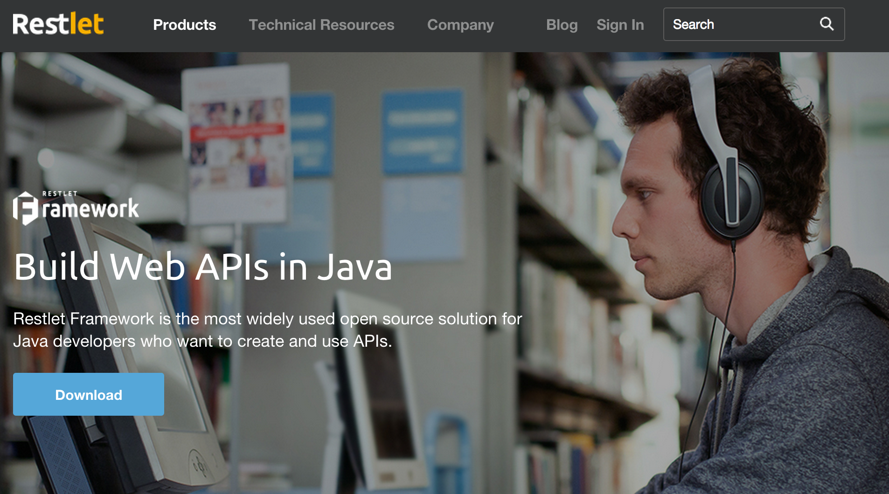
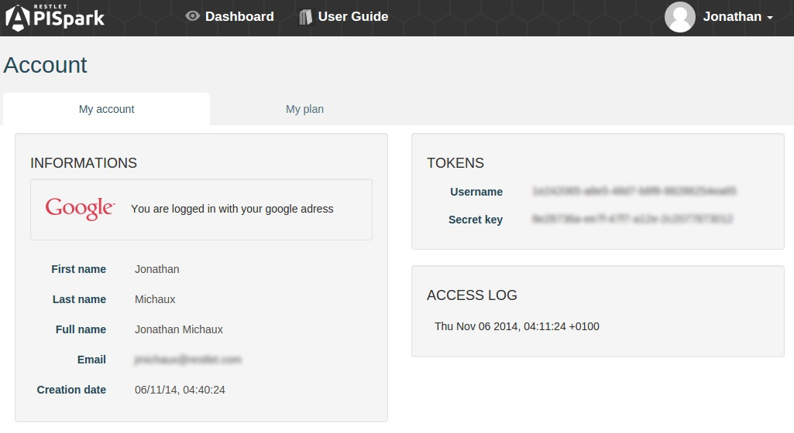

# Introduction

APISpark provides a tool that allows you to extract the web API definition of your Restlet application and import it in APISpark to provide documentation and tooling.

You can also initialize your web API from a JAX-RS application or from a Swagger definition.

With this tool, you will be able to create a new APISpark cell from your Restlet Application and edit it within APISpark.
By running the tool again, you will be able to synchronize web API changes initiated from your API's code.

In these scenarios we will leverage the Introspector tool by loading a web API definition into APISpark, updating this definition revision after a code change and create a new major version of your definition to prepare an upgrade.

# Launch process

First you need to install the *Introspector* tool either from the <a href="http://rest-let.com/products/restlet-framework/" target="_blank">Restlet Framework site</a> or from a Maven project if you are familiar with Maven.

You need to download the version 2.3 of Restlet Framework.

## Install from the Restlet site

Open the <a href="http://rest-let.com/products/restlet-framework/" target="_blank">Restlet Framework site</a> and select the version 2.3 of the JSE edition of the Restlet Framework.



Once extracted, you can run the Java Introspector Tool from the command line below, using your APISpark credentials.

```shell
java -cp "/path/to/your/lib/*:/path/to/restlet/lib/*:/path/to/restlet/lib/*/*" org.restlet.ext.apispark.Introspector --username 55955e02-0e99-47f8 --password 6f3ee88e-8405-44c8
--create-descriptor org.restlet.example.contact.api.ContactsApplication
```
From the command line, you have to configure the classpath with your application classes and dependencies, and with the Restlet Framework dependencies.

You will find the description of the different options used in the paragraphs below.

An easier way to configure your classpath is to let Maven manage the dependencies.

## Install with Maven

In order to use the Introspector tool from Maven, you need to add the following elements to your `pom.xml` or in a new one.

<!-- TODO or download [this one](images/pom.xml) -->

```xml
<project>
    <properties>
        <restlet-version>2.3</restlet-version>
    </properties>

    <dependencies>
        <dependency>
            <groupId>org.restlet.jse</groupId>
            <artifactId>org.restlet</artifactId>
            <version>${restlet-version}</version>
        </dependency>
        <dependency>
            <groupId>org.restlet.jse</groupId>
            <artifactId>org.restlet.ext.jackson</artifactId>
            <version>${restlet-version}</version>
        </dependency>
        <dependency>
            <groupId>org.restlet.jse</groupId>
            <artifactId>org.restlet.ext.apispark</artifactId>
            <version>${restlet-version}</version>
        </dependency>
    </dependencies>

    <repositories>
        <repository>
            <id>maven-restlet</id>
            <name>Public online Restlet repository</name>
            <url>http://maven.restlet.com</url>
        </repository>
    </repositories>
</project>
```

# Run the Instrospector tool

In order to upload your API definition to APISpark, you need to use your credentials.

## Retrieve your credentials

You can find your credentials in your **Account** page. To navigate to the **Account** page, make sure you are signed in, then click on your username on top right of your screen and select **My account**.



Your username and secret key are displayed in the **Tokens** section.

## Introspector usage

Different options are available from the Introspector. To have the exhaustive list of these options, add `--help` to the command line as shown below.

```shell
java org.restlet.ext.apispark.Introspector --help
```

The Introspector requires your credentials attributes, so add the `-u` (or `--username`) and the `-p` (or `--password`) options to each command.

```shell
java org.restlet.ext.apispark.Introspector --username 55955e02-0e99-47f8 --password 6f3ee88e-8405-44c8 [options]
```

Next, you have to add additional options according to the action you want to take.

## Upload your API definition to APISpark

For the first time, you have to choose if you want to create a [*Descriptor*](technical-resources/apispark/guide/document/overview "Descriptor") with `--create-descriptor` or a [*Connector*](technical-resources/apispark/guide/manage/connectors "Connector") cell with `--create-connector`. If you do not kwow yet, choose the *Descriptor* since you will be able to convert it in a *Connector* later.

Last things to do is to indicate the class of your Restlet Application (example `org.restlet.example.contact.api.ContactsApplication`).

Then, you can run the command.

```shell
java org.restlet.ext.apispark.Introspector --username 55955e02-0e99-47f8 --password 6f3ee88e-8405-44c8 --create-descriptor org.restlet.example.contact.api.ContactsApplication
```

If the process succeeds, you will see the following logs in the console:

```
Instrospection complete
Your Web API descriptor's id is: 18
Your Web API documentation is accessible at this URL: https://apispark.com/apis/18/versions/1/overview
```

That's it. Your API definition is available on APISPark.
