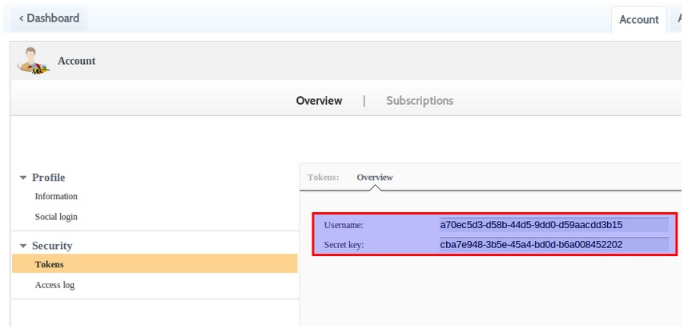
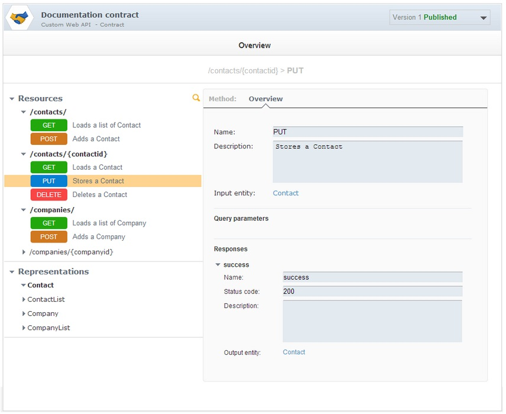

# Introduction

APISpark provides a tool thaht allows you to extract the web API definition of your Restlet API or JAX-RS API application and import it in APISpark to provide documentation and tooling.

You can:

* Introspect your Restlet-based or JAX-RS Web API or parse a Swagger definition to retrieve its description
* Display and edit this description within APISpark
* Synchronize Web API changes initiated from your API's code or Swagger

In these scenarios we will leverage the Introspector tool by loading a Web API definition into APISpark with the three types of inputs available. You can find a complete example of documentation generated via this tool here, the description fields weren't retrieved from the Restlet Framework code, they were added manually in APISpark.

#Launch process

In a first example, we will document a Restlet-based Web API. Users have to point the Introspector to the class extending org.restlet.Application. Here, the Application class in our code is org.restlet.api.MyContacts.

    java -cp "/path/to/your/lib/*" org.restlet.ext.apispark.Introspector -u 55955e02-0e99-47f8 -p 6f3ee88e-8405-44c8 org.restlet.api.MyContacts`

Then we will document an API based on its Swagger definition.

    java -cp "/path/to/your/lib/*" org.restlet.ext.apispark.Introspector -u 55955e02-0e99-47f8 -p 6f3ee88e-8405-44c8 -l swagger http://petstore.swagger.wordnik.com/api/api-docs`

And finish with a JAX-RS API.

    java -cp "/path/to/your/lib/*" org.restlet.ext.apispark.Introspector -u 55955e02-0e99-47f8 -p 6f3ee88e-8405-44c8 org.jaxrs.api.MyContacts`

> **Note:** For the JAX-RS introspection to work, users have to point the Introspector to a class extending javax.ws.rs.core.Application and listing all the JAX-RS annotated classes as follows:

    package org.coenraets.directory;

      import java.util.HashSet;
      import java.util.Set;
      import javax.ws.rs.core.Application;

      public class MyContacts extends Application {
      @Override
      public Set<Class<?>> getClasses() {
      Set<Class<?>> classes = new HashSet<Class<?>>();
      classes.add(EmployeeResource.class);
      return classes;
      }
      }
  `

Whether you use this class to run your Web API or not, you must create it to run the Introspector.

# Configuration

## Using maven

You can use the following pom.xml to get the dependencies required for the Introspector. The full project, containing the extension, the pom and the readme is available [here](http://http://restlet.com/learn/guide/archives/misc/2.3/org.restlet.ext.apispark.zip). Follow the instructions in the readme and use the extension from your favorite IDE.

    <?xml version="1.0" encoding="UTF-8"?>
      <project xmlns="http://maven.apache.org/POM/4.0.0" xmlns:xsi="http://www.w3.org/2001/XMLSchema-instance"xsi:schemaLocation="http://maven.apache.org/POM/4.0.0 http://maven.apache.org/maven-v4_0_0.xsd">
      <modelVersion>4.0.0</modelVersion>
      <repositories>
      <repository>
      <id>maven-restlet</id>
      <name>Restlet repository</name>
      <url>http://maven.restlet.com</url>
      </repository>
      </repositories>

      <artifactId>org.restlet.ext.apispark</artifactId>
      <groupId>org.restlet.jse</groupId>
      <name>Restlet Extension - APISpark</name>
      <description>Integration with APISpark cloud platform, by Restlet.</description>
      <version>2.3-M2</version>

      <dependencies>
      <dependency>
      <groupId>org.restlet.jse</groupId>
      <artifactId>org.restlet</artifactId>
      <version>2.3-M2</version>
      </dependency>
      <dependency>
      <groupId>org.restlet.jse</groupId>
      <artifactId>org.restlet.ext.jackson</artifactId>
      <version>2.3-M2</version>
      </dependency>
      </dependencies>
      </project>

## Manually

You must add the following jars (provided in <a href="http://restlet.com/technical-resources/restlet-framework" target="_blank">Restlet Framework</a>) in the "/path/to/your/lib" folder or manually to the classpath.

In Restlet Framework lib directory:

* org.restlet.jar (Restlet API)
* org.restlet.ext.apispark.jar (Restlet APISpark extension with Introspector class)
* org.restlet.ext.jackson.jar (Restlet Jackson extension)
* org.restlet.ext.xml (Restlet XML extension in Restlet framework lib directory)

In Restlet Framework lib/com.fasterxml.jackson_2.2/ directory:

* com.fasterxml.jackson.annotations.jar
* com.fasterxml.jackson.core.jar
* com.fasterxml.jackson.csv.jar
* com.fasterxml.jackson.databind.jar
* com.fasterxml.jackson.smile.jar
* com.fasterxml.jackson.yaml.jar

Your packaged Web API:
* org.restlet.api.jar org.jaxrs.api.jar (your packaged Web API)

# APISpark tokens

The parameters -u and -p are mandatory, they correspond to your APISpark user name and secret key. You can get those here under the tab "tokens". You will need to <a href="http://apispark.restlet.com/signin" target="_blank">sign up</a> first.

# Load Web API definition into APISpark (first call)

Here is the result, we get from the Introspector:

  `Process successfully achieved.
  Your Web API contract's id is: 246
  Your Web API documentation is accessible at this URL: https://apispark.com/apis/246/versions/1`

# Update your Web API definition (Subsequent calls )

You need to add a parameter -d giving the id of the definition, hosted on APISpark, that you want to update. You can find the parameter -d in two ways.

* It will be in the response body when you first use the extension on your API.
* If you did not write it down then you can go to your dashboard, click on the Web API Contract you want to update and get it from the URL. The URL should look like this: https://apispark.com/apis/[definition_id]/version/1/

# Debug the Web API introspection

If you want the introspector to display information about the web API definition, you can add the -v parameter to the command line. It will switch the application to a verbose mode.

# More about the Introspector Tool

The Restlet extension for APISpark provides a source code introspector that takes a class (your Restlet class extending the class Application) from your Web API as a parameter and instantiates its components to retrieve the contract of your API.

Here is its command line help:

      SYNOPSIS
      org.restlet.ext.apispark.Introspector [options] APPLICATION
      org.restlet.ext.apispark.Introspector -l swagger [options] SWAGGER
      DEFINITION URL/PATH
      DESCRIPTION
      Publish to the APISpark platform the description of your Web API,
      represented by APPLICATION, the full canonical name of your Restlet or JAX-RS
      application class or by the swagger definition available on the  URL/PATH.
      If the whole process is successfull, it displays the url of the
      corresponding documentation.
      OPTIONS
      -h, --help
      Prints this help.
      -u, --username
      The mandatory APISpark user name.
      -p, --password
      The mandatory APISpark user secret key.
      -c, --component
      The optional full canonical name of your Restlet Component class.
      This allows to collect some other data, such as the endpoint.
      -d, --definition
      The optional id of an existing definition hosted by APISpark you
      want to update with this new documentation.
      -l, --language
      The optional name of the description language of the definition
      you want to upload. Possible value: swagger
      -v, --verbose
      The optional parameter switching the process to a verbose mode

After introspecting your Restlet Framework code, you can work on your [Descriptor](technical-resources/apispark/guide/document/overview "Descriptor").
