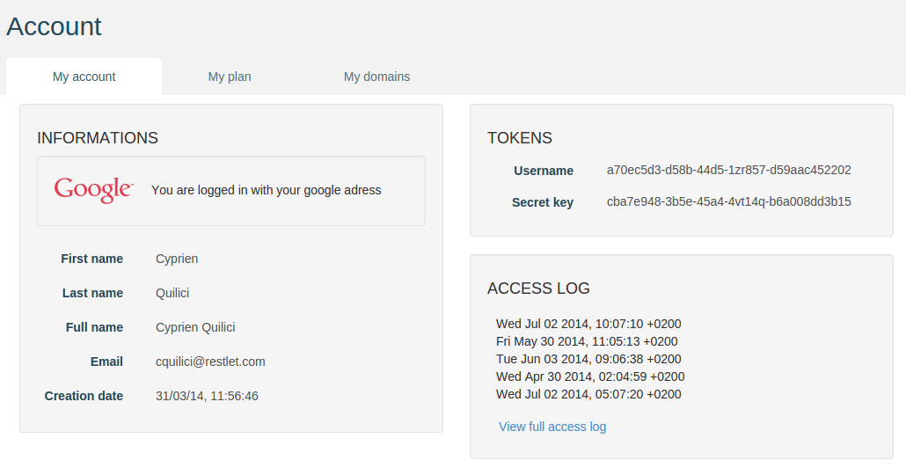

# Introduction

APISpark provides a tool to manage an existing web API hosted outside of APISpark. To get a full overview of the management features available, take a look at the [related documentation](https://restlet.com/technical-resources/apispark/guide/manage/connectors).

In this scenario, we will add authenticated access to an existing web API via the APISpark tool. If you do not have a running web API, you can use our sample API hosted on APISpark.

# 1. Create a web API Connector

If you have not already done so, <a href="
https://apispark.restlet.com/signin" target="_blank">sign in</a> to your APISpark account and open your **Dashboard**.

Create a new Connector. Click on **+ Web API**, select the "Connector" **Type** and enter the **Name** "myConnector".


Click on the **Add** button to create the new web API Connector. You will be taken to the new web API Connector's **Overview** page.

# 2. Configure the authentication feature

## 2.1. Enable the authentication feature

First of all, you will want to enable the authentication feature of the Connector you just created.  
To do so, click on the **Settings** tab.  
In the **Connector** section, select **Management features**.  
Select the **Authentication** checkbox in the central panel.


## 2.2. Add members to your web API

To add new consumers to your API, create new members from the **Members** tab.


Members of your web API Connector will be able to consume it once it has been deployed. A set of credentials will be auto-generated for each of them.

Each member of the Connector can use his APISpark credentials to consume the API. To get your credentials, go to your Account page by clicking on your name on top right of your screen and selecting **My Account**.



You can now **Deploy** your web API Connector.

# 3. Plug the agent to your web API

## 3.1. Launch your web API

If you have a web API running, make sure it is running. Otherwise just make GET calls on this URL:

[https://rsreferenceapi.apispark.net/v1/contacts/](https://rsreferenceapi.apispark.net/v1/contacts/)

## 3.2. Launch the agent

The agent is available for download from the **Remote agent** page: click on the **Settings** tab and select **Remote agent** from the **Connector** section.


You will download a zip file containing the jar and a configuration file. To learn how to configure the agent, please take a look at this [specific documentation](https://restlet.com/technical-resources/apispark/guide/manage/remote-agent) in the section **Configure the Agent**.

Once your agent is configured, launch it with the following command line:

```
java -jar -DapiSparkServiceConfig=/path/to/your/agent.properties apispark-agent.jar
```

# 4. Invoke the web API

Now that your environment is all set, try to call `http://localhost:8000` with and without providing valid credentials.

## 4.1. Calling the API with invalid credentials


## 4.2. Calling the API with valid credentials


Your API is now protected with authentication.

Congratulations on completing this tutorial! If you have questions or suggestions, feel free to contact the <a href="http://support.restlet.com/" target="_blank">Help Desk</a>.

