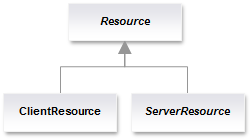

# Packages restructuring

In order to simplify even more the learning and deployment of Restlet
applications, the Restlet API and its implementation (ie. the Restlet
Engine) have been merged into a single module (ie. JAR, bundle). All
engine classes were moved to
[org.restlet.engine](javadocs://2.0/jse/engine/).

In addition, all extensions are now located under a
[org.restlet.ext](javadocs://2.0/jse/ext/)
root package. This means that all extensions previously under
"com.noelios.restlet.ext" have been moved. Note that some classes from
the [core Restlet API](javadocs://2.0/jse/api/)
have been moved to the Restlet Engine such as:

-   org.restlet.util.Engine moved to org.restlet.engine.Engine
-   org.restlet.util.Helper moved to org.restlet.engine.Helper
-   org.restlet.util.ByteUtils moved to org.restlet.engine.io.BioUtils
-   org.restlet.util.DateUtils moved to org.restlet.engine.util.DateUtils

Note also, that there were two Spring extensions in Restlet 1.1. Now
they are merged under the org.restlet.ext.spring extension.

In order to ensure a cleaner separation between resource and
representation artifacts, we have added a new
“org.restlet.representation” package and moved all representation
classes to it. The “org.restlet.resource” package is now more focused,
allowing us to welcome our new resource API and to move in related
classes such as Finder and Handler. We have also added a
“org.restlet.routing” package where we moved Filter, Redirector and
Router related classes.

# Root package

The org.restlet.Uniform abstract class has been refactored into an
interface with a single handle(Request, Response) method. Its logic has
been moved to the org.restlet.Client class. This allows us to leverage
it for asynchronous calls, as we already do in the GWT edition.

We moved Message, Request and Response classes from the
"org.restlet.data" to the "org.restlet" root package as they are core
artifacts of the API used in Uniform interface. Requests and responses
can now be aborted, useful to save bandwidth where undesired calls are
handled.

In order to support both inbound and outbound routing and filtering of
calls for Restlet applications, we have added two properties:
“inboundRoot : Restlet” and “outboundRoot : Restlet” to the Application
class and deprecated the “root : Restlet” property. This will allow you
to easily provide features such as preemptive authentication with the
recently added ClientResource class.

The component XML configuration has been extended to support all
existing properties and features available in the Java API.

# Data package

Nearly all standard HTTP headers are now fully supported by the Restlet
API including “Age”, “Authentication-Info”, “Date”, "Expect",
“If-Range”, “Retry-After”, "Via", “Warning”, and the frequently asked
“Cache-Control” header! For a detailled mapping of those headers to the
Restlet API, please consult [this page of the user guide](technical-resources/restlet-framework/guide/2.2/core/http-headers-mapping).

Character sets support was enhanced, fixing an issue with Macintosh and
adding new constants in the CharacterSet class for all common ones
defined by IANA. Also, the default language used for representation is
now dynamically retrieved based on the JVM setting instead of
English/US.

# Representation package

Added AppendableRepresentation for dynamic generation of
StringRepresentation instances.

# Resource package

After a long experience with our class-driven Resource API introduced in
Restlet 1.0 and the recent introduction of the annotation-driven JAX-RS
API (that we support as a special Restlet extension), we felt it was
time for us to step-back and propose a better solution, taking the best
of both experiences.

We initiated a [specification effort](/participate#/172-restlet/226-restlet.html)
in our developers wiki at the beginning of this year, taking into
account all the enhancement requests, issues and feed-back made by our
community. Here is the overall architecture:

The new design uses three foundation classes (UniformResource,
ClientResource and ServerResource) which support just four annotations
by default: @Get, @Post, @Put and @Delete. New ones can be defined to
support extension methods like @Copy and @Move for WebDAV. Note that the
support for annotations can be turned off and is not necessary to
develop resources.

This new design provides the best of both worlds, the power and
flexibility of Restlet 1.1 and the expressiveness and additional
abstraction offered by JAX-RS. In addition, it goes beyond those
existing APIs by offering a uniform support for both server and client
resources !

The ServerResource class  cleanly integrates the annotation-based and
method-based call processing : the annotation-based processing extends
the usual method-base processing.

ClientResource also support for annotated interfaces via the creation of
dynamic proxies. It also automatically follows redirections when
possible. Access to the underlying ClientResource instance for dynamic
proxies is possible via a ClientProxy interface automatically
implemented, like for the GWT edition. Proxies for child or parent
resource can also easily be obtained, reusing the current resource like
a prototype resource!

Asynchronous call handling is now available on both on the server-side
and the client-side. The callback mechanism used was inspired from GWT
and is fully consistent with our Restlet edition for GWT, ensuring a
greater portability.

# Routing package

The "org.restlet.routing" package has been enhanced with new Validator
and Extractor filters containing logic found in the new deprecated Route
class, replaced with a more specific TemplateRoute class. Those changes
should be transparent for most applications using the Router class to
attach Restlets and resources using URI templates.

We also moved Template and Variable classes from "org.restlet.util"  to
"org.restlet.routing" package.

# Security package

The refactoring of the Restlet security model has been the most
requested change since the Restlet 1.0 release. Fortunately, after a
long maturation period, it has finally made a huge step forward,
materialized by the addition of an “org.restlet.security” package. The
new design is the
[synthesis](/participate#/172-restlet/212-restlet.html)
of many contributions and discussions from the community. Care has been
taken to keep a separation of concern between Components and
Applications regarding security.

Security realms now have a lifecycle allowing the initialization from a
relational database, a file or a LDAP directory.

The API is also extensible and offers a good foundation for your new
security efforts.

# Service package

Refactored the services to facilitate the addition of new ones by users
in their applications or their components.

The TunnelService now supports “X-HTTP-Method-Override” header.

More powerful ConverterService which can automatically serialize POJOs
into XML, JSON and other serialization formats such as regular Java
serialization or long term bean persistence. We leverage XStream for
automatic XML/JSON marshalling and unmarshalling. Note that the JAX-RS
extension now also relies on this improved conversion service!
Converters were added for all relevant Restlet extensions, allowing
usage of high-level classes in annotated Restlet interfaces for example.
