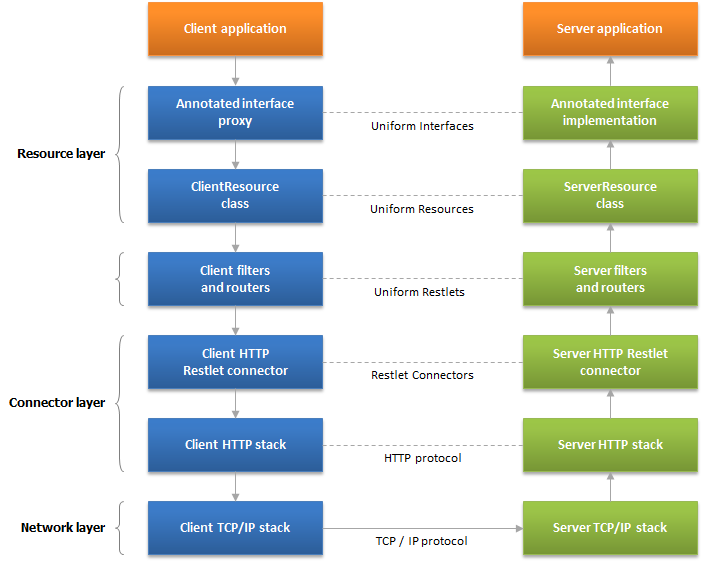
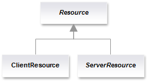

# Introduction

The **org.restlet.resource** package contains client and server resource classes.

# Architecture

Below is an overview of the architecture, including all processing layers, from the lowest TCP/IP network  layer to the highest annotated interface proxies.



## Class diagram

Here is a class diagram:



## Annotations

We also defined a set of method level annotations:

Annotation | Description
---------- | -----------
@Delete    | Annotate methods that remove resources.
@Get       | Annotate methods that represent a variant of a resource
@Options   | Annotate methods that accept representations.
@Post      | Annotate methods that accept representations.
@Put       | Annotate methods that store representations.

Those annotations are specific to the Restlet API and shouldn't be
confused with those of the JAX-RS API. For support of the JAX-RS API by
the Restlet Framework, you should look at [the provided
extension](technical-resources/restlet-framework/guide/2.3/extensions/jaxrs "JAX-RS extension").

## Annotations parameter

All annotation have a single optional parameter. Its name is the default
"value" name allowing a compact annotation syntax.

Here is the grammar for this parameter:

```
    CHARACTER  = 'a-z' | 'A-Z' | '0-9'
    TOKEN      = CHARACTER [CHARACTER]*
    EXTENSION  = TOKEN
    PARAMETER  = TOKEN ['=' TOKEN]
    VARIANT    = EXTENSION ['+' EXTENSION]*
    ENTITY     = VARIANT ['|' VARIANT]*
    INPUT      = ENTITY
    OUTPUT     = ENTITY
    QUERY      = PARAMETER ['&' PARAMETER]
    ANNOTATION = INPUT [',' INPUT]* [':' OUTPUT] ['?' QUERY]
```

Here are some valid values:
```
~~~~ {.brush: .java}
    // Returns a representation in the "text/xml" media type
    @Get("xml")
    String toString();

    // Stores representations in the "text/xml" media type
    // after conversion to a DOM document
    @Put("xml")
    void store(Document doc)

    // Stores representations in the "text/xml" media type after
    // conversion to a DOM document and returns a plain text response
    @Put("xml:txt")
    String store(Document doc)

    // Returns a representation in the "text/xml" media type with
    // an inlining depth level of 2
    @Get("xml?depth=2")

    // Alternative variants
    @Put("xml|json:json")

    // Alternative variants
    @Put("xml+ascii | json+utf8 : json")
~~~~
```
>**Note** the importance of registering the proper extension names via the
MetadataService in order to use additional extension names.

## Sample code

Here is how a sample resource would look like with the refactored API.
Note that both extension names and full MIME type would be supported.
Extensions can be updated via the MetadataService.
```
~~~~ {.brush: .java}
    import java.io.InputStream;

    import org.restlet.ext.atom.Feed;
    import org.restlet.resource.Delete;
    import org.restlet.resource.Get;
    import org.restlet.resource.Post;
    import org.restlet.resource.Put;
    import org.restlet.resource.Representation;
    import org.restlet.resource.ServerResource;
    import org.w3c.dom.Document;

    public class TestResource extends ServerResource {

        @Get
        public Feed toAtom() {
            // ...
            return null;
        }

        @Get("xml?deep")
        public Representation toXml() {
            // ...
            return null;
        }

        @Post("xml:xml")
        public Representation accept(Document entity) {
            // ...
            return null;
        }

        @Put("atom|json")
        public void storeAtom(Feed feed) {
            // ...
        }

        @Put("cust")
        public void storeXml(InputStream stream) {
            // ...
        }

        @Delete
        public void removeAll() {
            // ...
        }

    }
~~~~
```
