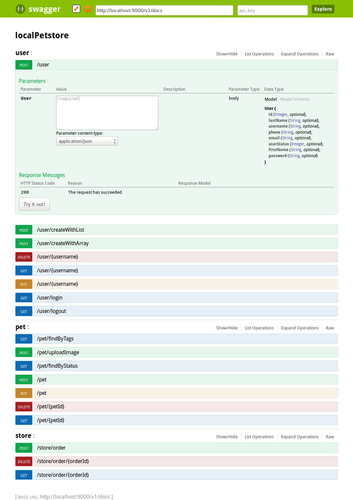

# Introduction

This extension provides a preview integration with [Swagger](https://helloreverb.com/developers/swagger) including:

- automated generation of Swagger descriptor in JSON
- introspection of JAX-RS API based applications
- introspection of Restlet API based applications

Additional work is required to:

- parse a Swagger descriptor in JSON to set up an application

In this scenario, we will add Swagger support to a Restlet based API then display its Swagger-UI.
You can download [this code](/learn/archives/examples/swagger/SwaggerApplicationExample.zip) and follow the README.md to get a sample application and try it out.

# Usage

## Dependencies

Add org.restlet.ext.swagger.jar (provided in the "lib" directory of
[restlet framework](http://restlet.com/downloads/current#release=testing&edition=jse&distribution=zip
"download restlet framework")) to your classpath.

Make sure you are using the version 2.3 of Restlet and java 1.7.

## Configuration

Make your application class extend org.restlet.ext.swagger.SwaggerApplication instead of org.restlet.Application.

By default, the Swagger documentation will be available on the path "/api-docs" of your API. If you want to change this path, you can specify it manually in the method _createInboundRoot_:

```java
public Restlet createInboundRoot() {
        // Router for the API's resources
        Router apiRouter = createApiRouter();
        attachSwaggerSpecificationRestlet(apiRouter, "/docs");
        // Protect the set of resources
        ChallengeAuthenticator guard = createApiGuard(apiRouter);
        return guard;
    }

```

Here, you specify that the Swagger definition will be provided on the path "/docs".

# Customization

If you want to display a definition edited manually, the SwaggerApplication can get it directly from files. To do that, you just have to override the method _getSwaggerSpecificationRestlet()_ of class SwaggerApplication and make it return a custom Restlet.

See sample implementation below:

```java

@Override
    public SwaggerSpecificationRestlet getSwaggerSpecificationRestlet(
            Context context) {
        return new SwaggerSpecificationRestlet(getContext()) {
            @Override
            public Representation getApiDeclaration(String category) {
                JacksonRepresentation<ApiDeclaration> result = new JacksonRepresentation<ApiDeclaration>(
                        new FileRepresentation("/path/to/my/repo/" + category,
                                MediaType.APPLICATION_JSON),
                        ApiDeclaration.class);
                return result;
            }

            @Override
            public Representation getResourceListing() {
                JacksonRepresentation<ApiDeclaration> result = new JacksonRepresentation<ApiDeclaration>(
                        new FileRepresentation("/path/to/my/repo/api-docs",
                                MediaType.APPLICATION_JSON),
                        ApiDeclaration.class);
                return result;
            }
        };
    }

```

# Swagger-UI

To display the Swagger-UI of your API, go on the page http://petstore.swagger.wordnik.com, enter the URL of your Swagger definition and click on explore.



You can also clone/fork the [project](https://github.com/wordnik/swagger-ui) and embed it.

For additional details, please consult the
[Javadocs](javadocs://jse/ext/org/restlet/ext/swagger/package-summary.html).
