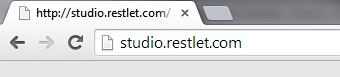

To craft your web APIs in Restlet Studio console, you do not need to sign in first.

Launch Restlet Studio from your web browser at the following address:  
`studio.restlet.com`

You can also launch Restlet Studio as a [Google Chrome application](technical-resources/restlet-studio/guide/get-started/chrome-application "Google Chrome application") without signing in.
