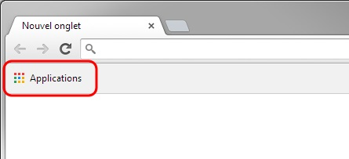
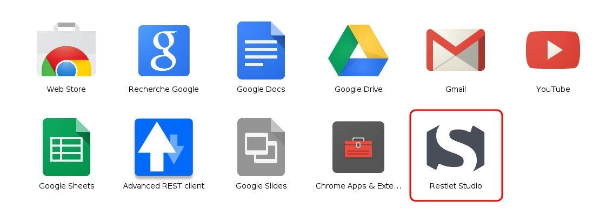

Restlet Studio has a special integration with Google Chrome.

To launch Restlet Studio as a Chrome application: 

1. Launch Chrome web browser.
2. In the bookmarks bar, click on the **Applications** menu.

	

3. Click on **Restlet Studio** icon.

	