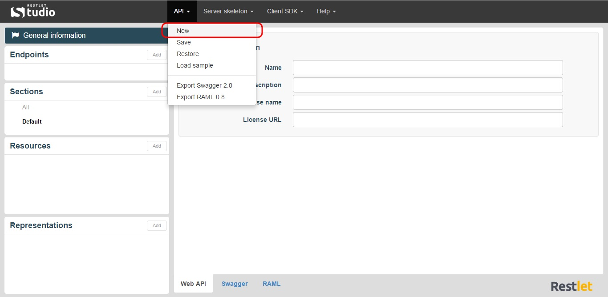

Restlet Studio allows you to craft your APIs from scratch from its design view. You can visually edit the [endpoints](technical-resources/restlet-studio/guide/craft/endpoints "endpoints"), [resources](technical-resources/restlet-studio/guide/craft/resources "resources"), methods and [representations](technical-resources/restlet-studio/guide/craft/representations "representations") of your API. You can also classify your resources and representations by creating sections.

# Create a new API definition

To create a new API definition, start entering its characteristics in the **General Information** window and create the different items necessary in the left panel.
To start again from scratch, click on the **API** menu and select **New**.

## Save and restore your API definition

To save the API definition you are designing, click the **API** menu and select **Save**. Your API definition is saved in your web browser local storage. You can now close your web browser.
To restore the version you saved, open Restlet Studio in the same web browser, click the **API** menu and select **Restore**.

>**Note:** Your web browser local storage is specific to each web browser. If you cannot find the last version saved, check out your web browser preferences. In Google Chrome, press CTRL+MAJ+Suppr keys, and make sure the **Hosted app data** checkbox is not selected.

# Load an API definition sample

If you wish to see an API definition sample, Restlet Studio provides you one by cliking the **API** menu and selecting **Load sample**.
