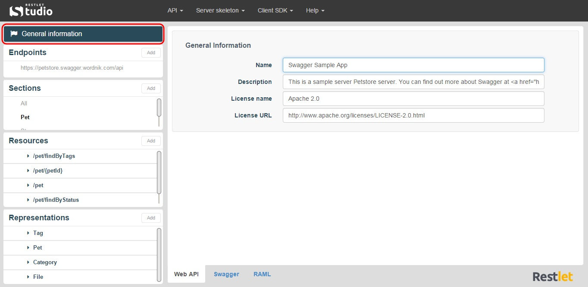

Restlet Studio also provides you with General information such as the copyright owner, license and description of your API.

To get your API General information, click on the **General information** section on top of the left panel.

