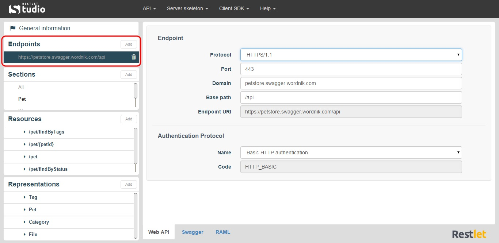
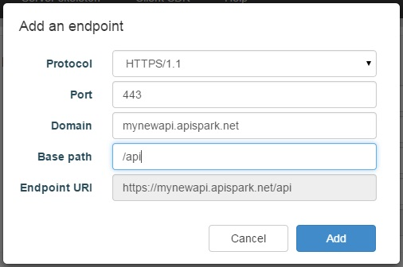

An API Endpoint is the address or URI (Uniform Resource Identifier) where the service can be accessed by a client application. The same web service can have multiple Endpoints, for example in order to make it available using different protocols (HTTP or HTTPS).  

Here is a URI example: `https://departmentapi.apispark.net/v2`  

On Restlet Studio console, you can find the different Endpoints of your API in the **Endpoints** section.

# Add an Endpoint

In the **Endpoints** section, click on the appropriate Endpoint. The Endpoint details display in the central panel.

Click on the **Add** button of the **Endpoints** section.

Fill in the **Add an endpoint** window and click on the **Add** button. The new Endpoint displays in the **Endpoints** section.
