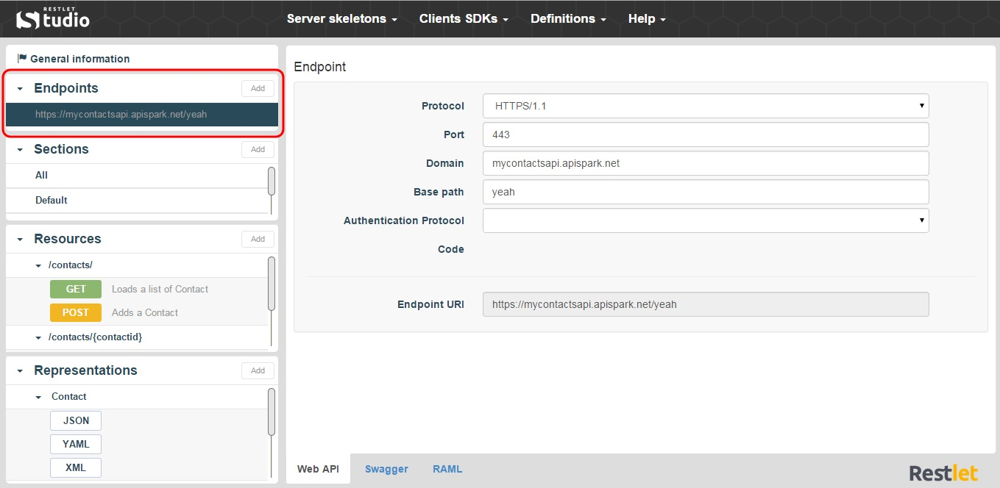

An API endpoint is the address or URI (Uniform Resource Identifier) where the service can be accessed by a client application. The same web service can have multiple endpoints, for example in order to make it available using different protocols.  
Here is a URI example: `https://departmentapi.apispark.net/v2`  
On Restlet Studio console, you can find the different endpoints of your API in the **Endpoints** section.

In the **Endpoints** section, click on the appropriate Endpoint. The endpoint details display in the center panel.

To add new endpoints, click on the **Add** button of the **Endpoints** section.