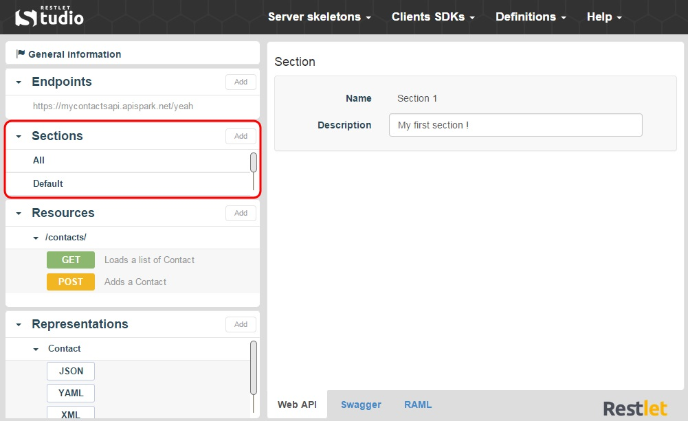
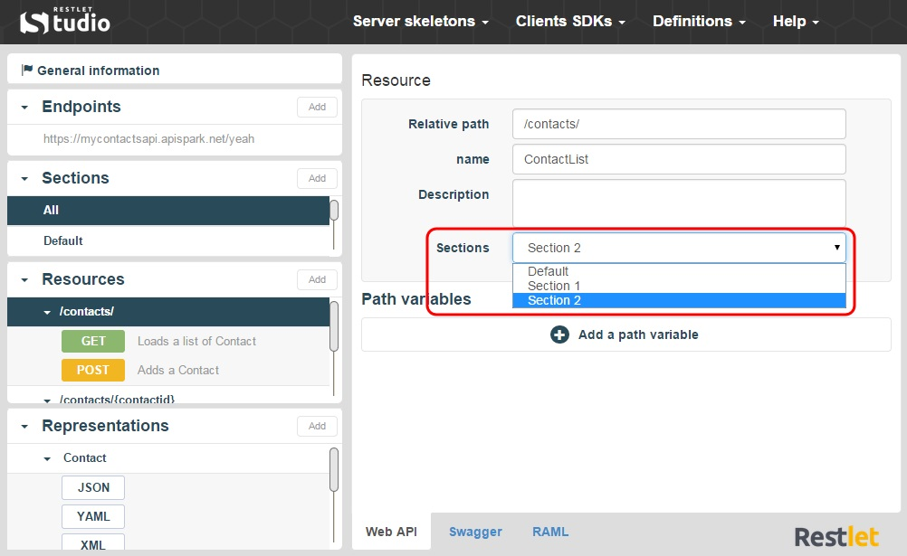
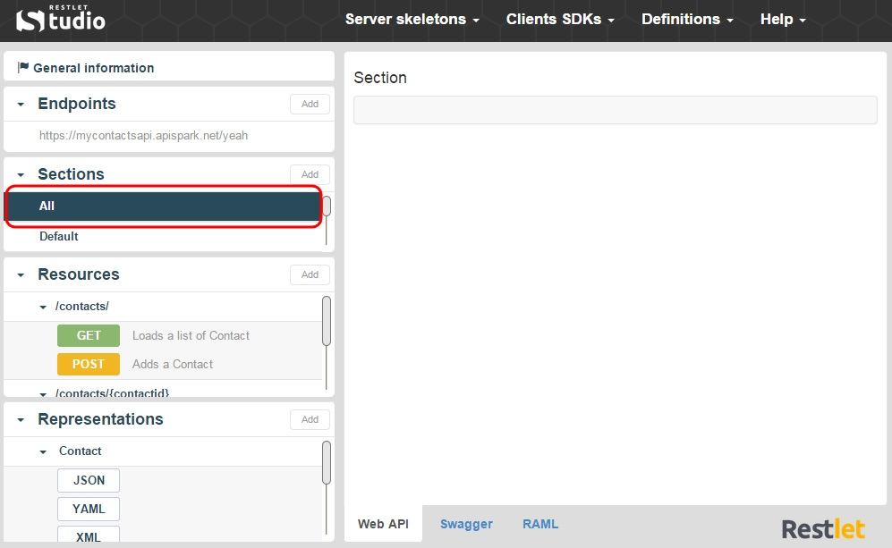

In Restlet Studio, sections can be defined to group resources and representations, very much like packages for Java classes. Sections will allow you to organize the different items of your API.

#Add a Section

1. In the **Sections** section, click on the appropriate section. The resources and representations linked display underneath.

	

2. Click on the **Add** button of the **Sections** section.

	

#Add a Resource or Representation

1. To add a resource (or representation) to your section, click on the appropriate resource (or representation) in the **Resources** (or **Representations**) section.
2. In the **Sections** drop-down menu of the central panel, select the appropriate section.

	

3. To display all your resources and representations again (with no filter), click on **All** in the **Sections** section.

	