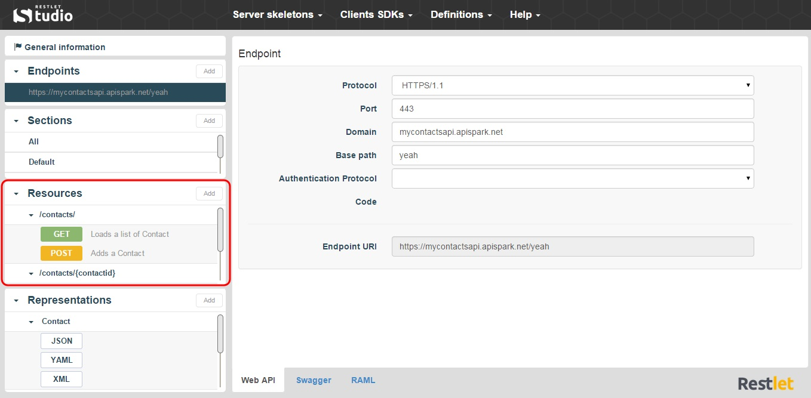

Each resource has its own address or URI (Uniform Resource Identifier). Resources should be named by nouns as opposed to verbs or actions. In other words, a URI should refer to a resource that is a thing instead of referring to an action: nouns have properties as verbs do not.  

On Restlet Studio console, you can find the resources of your API endpoint in the **Resources** section. Click on the appropriate endpoint. The resources linked display in the **Resources** section.

  
Here is a resource example: `https://employeedirectory.apispark.net/v2/employees`  
For each resource, the possible request methods (POST, GET, PUT and DELETE) are displayed underneath.  
To change the resource path, click on the appropriate resource in the **Resources** section and enter a new path in the **Relative path** field.