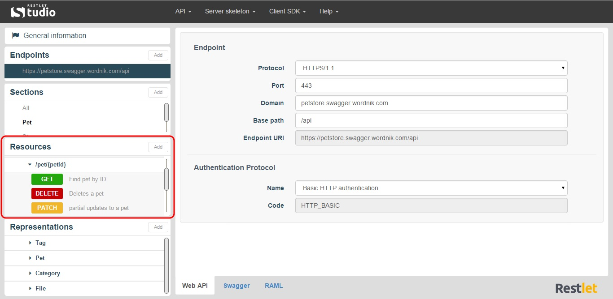
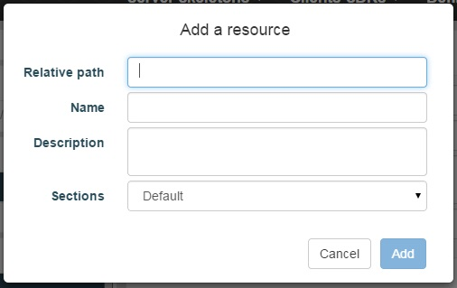
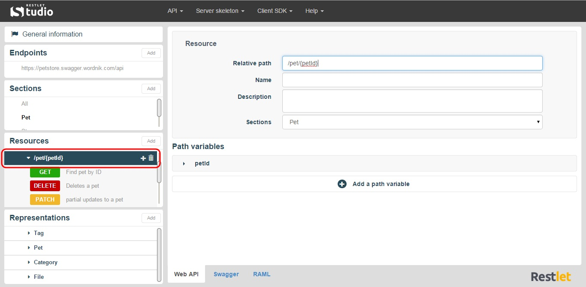
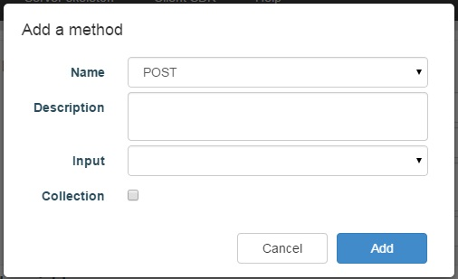
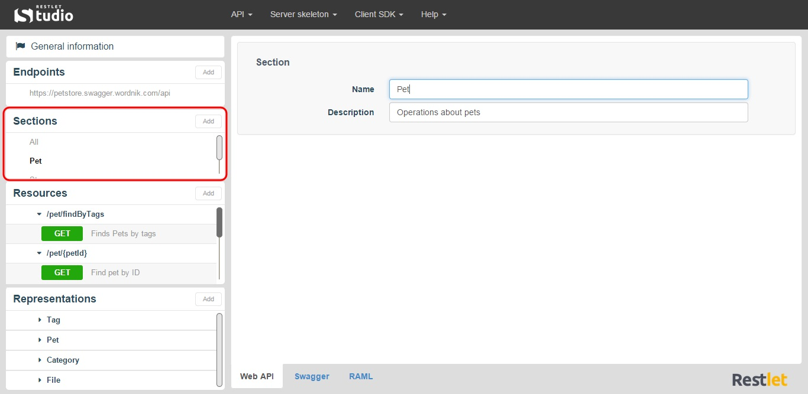
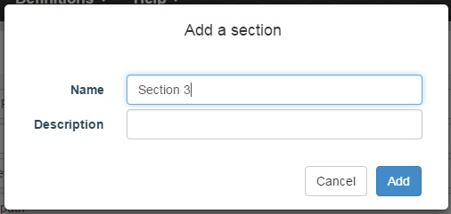
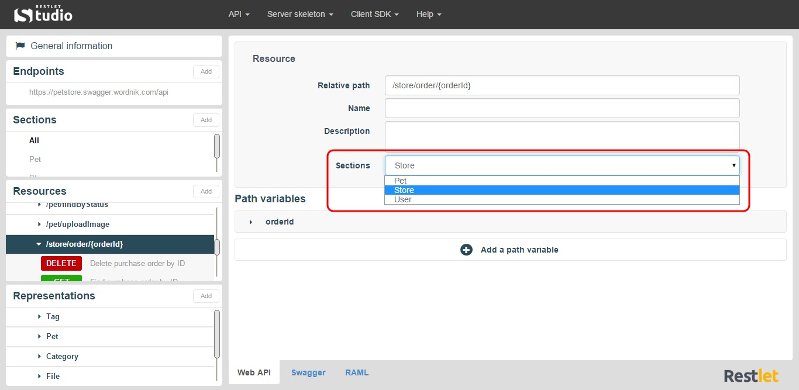
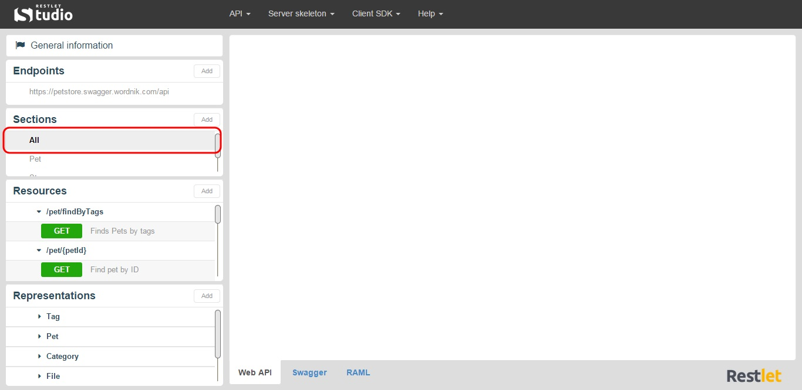

# Introduction

Each resource has its own address or URI (Uniform Resource Identifier). Resources should be named using nouns as opposed to verbs or actions. In other words, a URI should refer to a Resource that is an item instead of referring to an action: nouns have properties as verbs do not.  

On Restlet Studio console, you can find the Resources of your API endpoint in the **Resources** section. Click on the appropriate Endpoint and the Resources linked display in the **Resources** section.

Here is a Resource example: `https://myapi.apispark.net/v2/employees`  
For each Resource, the possible request methods (POST, GET, PUT, PATCH, DELETE, etc.) display underneath.

# Add a Resource

Click on the **Add** button of the **Resources** section.

Fill in the **Add a resource** window and click on the **Add** button. The new resource displays in the **Resources** section.

>**Note:** To change the Resource path, click on the appropriate Resource in the **Resources** section and enter a new path in the **Relative path** field.

# Add a Method

Click on the appropriate Resource in the **Resources** section.  
Click on the **+** button on the right of the Resource.

Fill in the **Add a method** window and click on the **Add** button.

# Add a Section

In Restlet Studio, sections can be defined to group resources and representations, very much like packages for Java classes. Sections will allow you to organize the different items of your API.

In the **Sections** section, click on the appropriate section. The resources and representations linked display underneath.

Click on the **Add** button of the **Sections** section.

## Add a Resource or Representation to your Section

To add a resource (or representation) to your section, click on the appropriate resource (or representation) in the **Resources** (or **Representations**) section.  
In the **Sections** drop-down menu of the central panel, select the appropriate section.

To display all your resources and representations again (with no filter), click on **All** in the **Sections** section.

