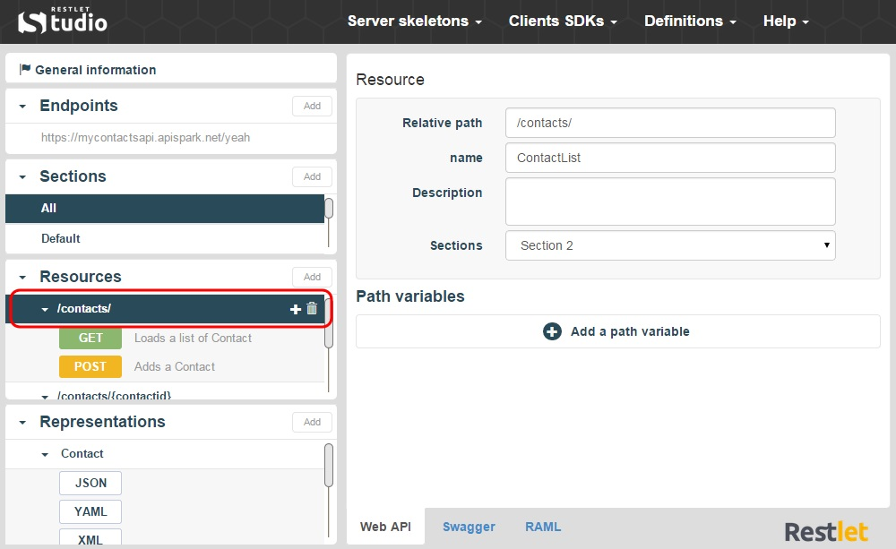
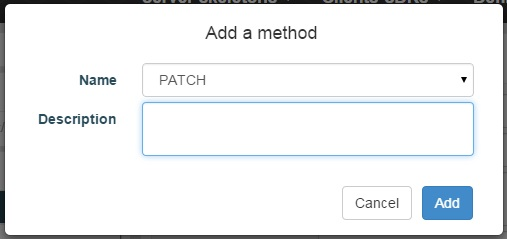

Each resource has its own address or URI (Uniform Resource Identifier). Resources should be named by nouns as opposed to verbs or actions. In other words, a URI should refer to a Resource that is a thing instead of referring to an action: nouns have properties as verbs do not.  

On Restlet Studio console, you can find the Resources of your API endpoint in the **Resources** section. Click on the appropriate Endpoint. The Resources linked display in the **Resources** section.

  
Here is a Resource example: `https://employeedirectory.apispark.net/v2/employees`  
For each Resource, the possible request methods (POST, GET, PUT, PATCH, DELETE, etc.) are displayed underneath.

#Add a Resource

1. Click on the **Add** button of the **Resources** section.

	

2. Fill in the **Add a resource** window and click on the **Add** button. The new resource displays in the **Resources** section.
  
>**Note:** To change the Resource path, click on the appropriate Resource in the **Resources** section and enter a new path in the **Relative path** field.

#Add a Method

1. Click on the appropriate Resource in the **Resources** section. 
2. Click on the **+** button on the right of the Resource.

	

3. Fill in the **Add a method** window and click on the **Add** button.

	