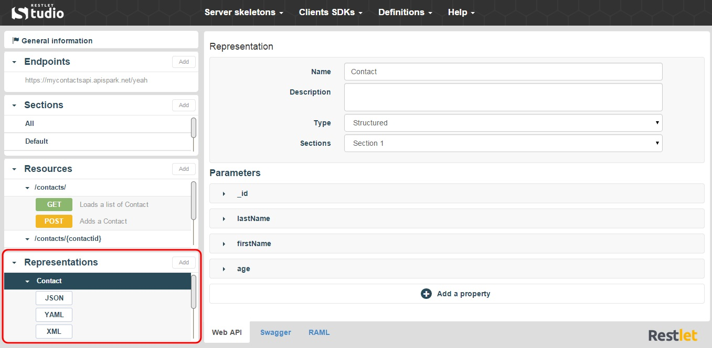
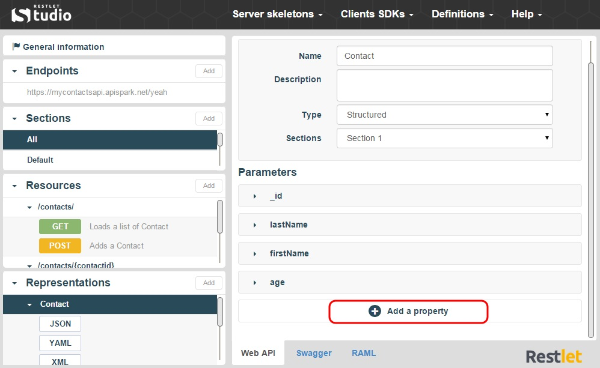
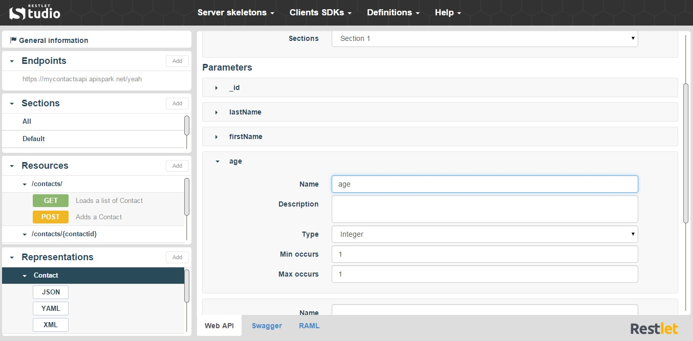
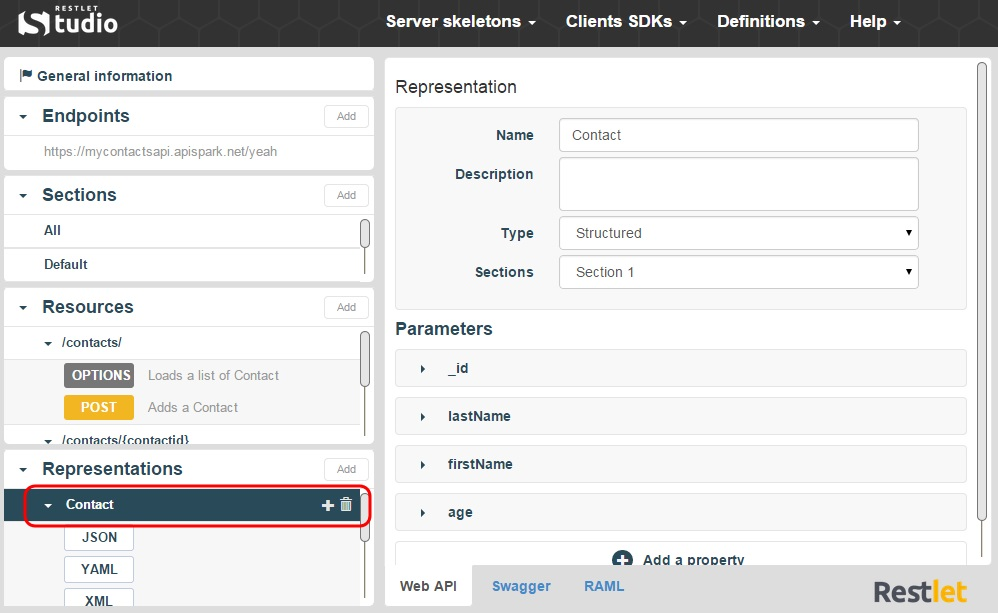
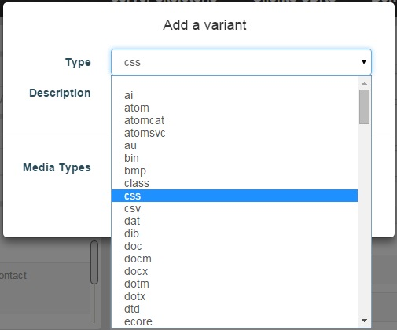

Essentially, an API is a collection of URIs, HTTP calls to those URIs and some representations of resources. Restlet Studio offers several representation variants such as XML, JSON or YAML.

On Restlet Studio, you can find the representations of your API endpoint resource in the **Representations** section.

# Add a Representation

1. Click on the appropriate Resource in the **Representations** section. The Representations available for the resource selected display underneath.

	

2. Click on the **Add** button of the **Representations** section.

	

3. Fill in the **Add a representation** window and click on the **Add** button.

# Add a Property

1. Click on the appropriate Representation in the **Representations** section.

	

2. In the central panel, click on the **+Add a property** button.

#Change Representation Properties

1. Click on the appropriate representation in the **Representations** section.

	

2. Select the appropriate property in the central panel and change the elements you need to modify.

# Add a variant

1. Click on the appropriate Representation in the **Representations** section.
2. Click on the + button on the right of the Representation.

	

3. In the **Add a variant** window, select the variant type you want to add.

	
