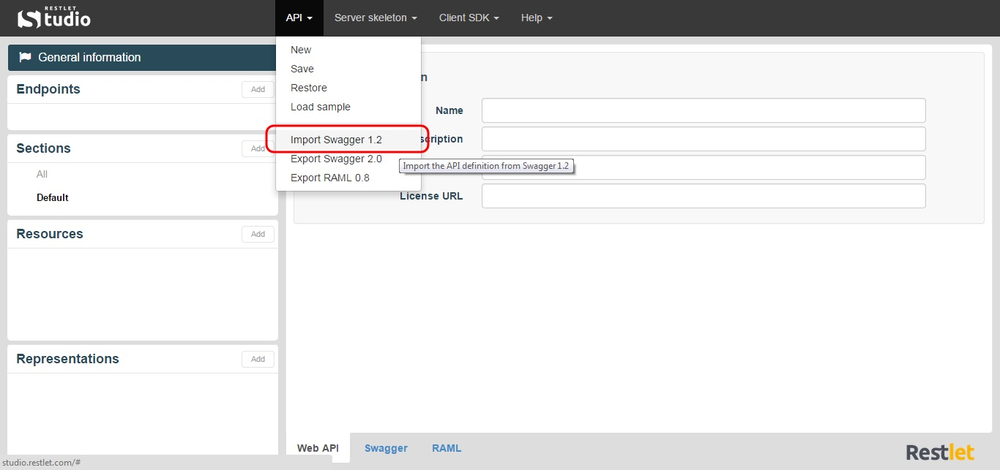

Swagger is an API description language that comes with number of tools including Swagger UI and Swagger Code Generator. Swagger UI provides a nice HTML presentation of your API’s contract and allows you to test your API by calling it. Swagger Code Generator generates client kits for your API in eight languages.

Restlet Studio allows you to import your API declaration in Swagger 1.2 format. You can then edit it from Restlet Studio, download the server skeleton or client SDKs, etc.

# Import your API declaration

If you have designed a web API declaration in Swagger 1.2 format, you can import and edit it from Restlet Studio.

Click on the **API** menu and select **Import Swagger 1.2**.

Select the .json file that contains your API declaration and **Import** it.
