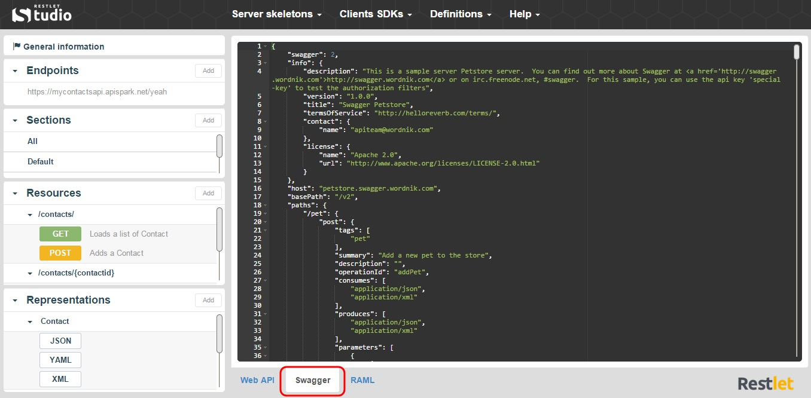
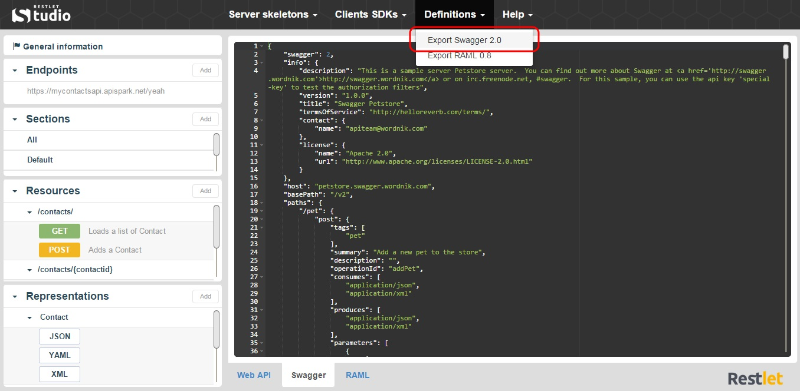

Swagger is an API description language that comes with number of tools including Swagger UI and Swagger Code Generator. Swagger UI provides a nice HTML presentation of your API’s contract and allows you to test your API by calling it. Swagger Code Generator generates client kits for your API in eight languages.

Restlet Studio dynamically generates the Swagger description of web APIs. You can  view your API Swagger definition in the **Swagger** tab and also export this definition.

#View the Swagger definition of your API

You can design your API without knowing Swagger syntax. But if you wish to see what your API looks like in Swagger format, Restlet Studio provides you with a **Swagger** tab in Read-only mode. 

1. Design your API in the **Web API** tab.
2. Click on the **Swagger** tab. You can copy and paste its content or just visualize it.

	

#Get your API definition in Swagger format

Once you have designed your web API, you can export it in Swagger format.

1. Click on the **Definitions** menu and select **Export Swagger 2.0**.

	

2. Download the .json file that contains your API definition.