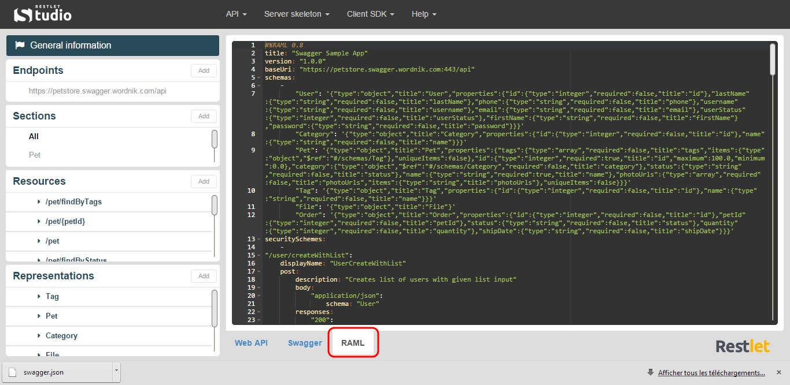
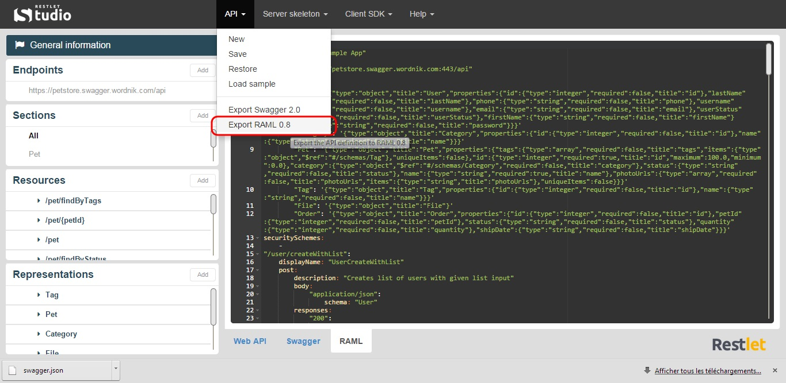

RAML (RESTful API Modeling Language) is a YAML-based, simple and succinct language that describes RESTful APIs. It is built on broadly-used standards such as YAML and JSON.

Restlet Studio dynamically generates the RAML description of web APIs. You can  view your API RAML definition in the **RAML** tab and also export this definition.

# View the RAML definition of your API

You can design your API without knowing RAML syntax. But if you wish to see what your API looks like in RAML format, Restlet Studio provides you with a **RAML** tab.

Design your API in the **Web API** tab.
Click on the **RAML** tab. You can copy and paste its content or just visualize it.

# Get your API definition in RAML format

Once you have designed your web API, you can export it in RAML format.

Click on the **API** menu and select **Export RAML 0.8**.

Download the .yml file that contains your API definition.
