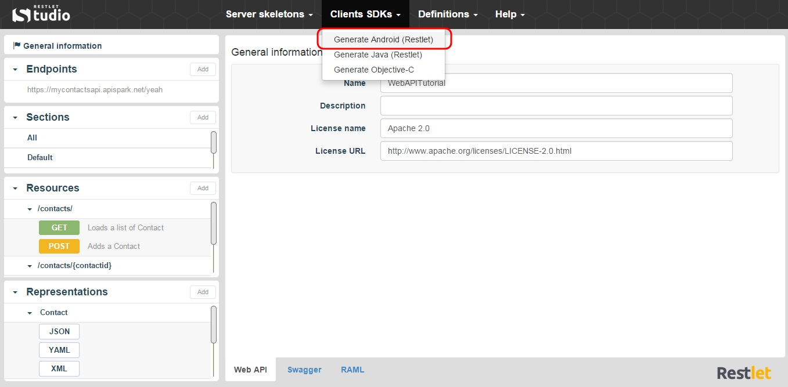

Restlet Studio provides you with client SDKs (Software Development Kit) and server skeletons which avoids you repetitive and non qualitative work that often leads to bugs.  

Restlet Studio allows you to get an Android SDK for your web API.

#Get the Android SDK for your API 

Once you have designed your web API, you can export its Android SDK.

1. Click on the **Clients SDKs** menu and select **Generate Android (Restlet)**.

	

2. Download the .zip file that contains your Android SDK.