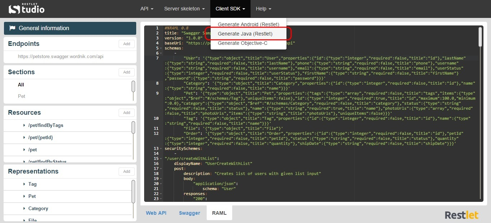

Restlet Studio provides you with client SDKs (Software Development Kit) and server skeletons which avoids you repetitive and non qualitative work that often leads to bugs.  

Restlet Studio allows you to get a Java SDK for your web API.

# Get the Java SDK for your API

Once you have designed your web API, you can export its Java SDK.

Click on the **Clients SDKs** menu and select **Generate Java (Restlet)**.

Download the .zip file that contains your Java SDK.
