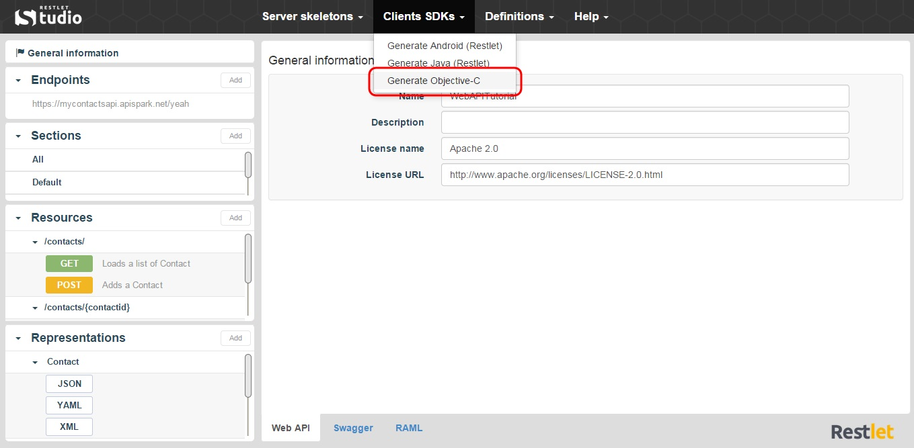

You are provided with client SDKs (Software Development Kit) and server skeletons which avoids you repetitive and non qualitative work that often leads to bugs.  

Restlet Studio provides you with the Objective-C SDK for your web API. You can export your Objective-C SDK from the **Clients SDKs** menu.

#Get the Objective-C SDK for your API 

Once you have designed your web API, you can export its Objective-C SDK.

1. Click on the **Clients SDKs** menu and select **Generate Objective-C**.

	

2. Download the .zip file that contains your Objective-C SDK.