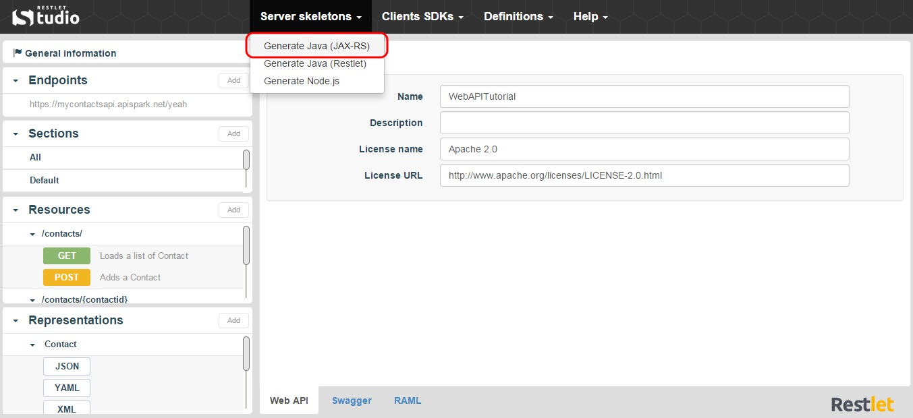

Restlet Studio provides you with the server code for your API. Your server skeleton is available in Java (following JAX-RS standard Framework or Restlet Framework) and JavaScript (Node.js). 

JAX-RS (Java API for RESTful Web Services) is a Java programing interface that allows you to create web services with a REST architecture.

To download your Java server skeleton:

1. Click on the **Server skeletons** menu and select **Generate Java (JAX-RS)**.

	

2. Download the .zip file that contains your Java server skeleton.