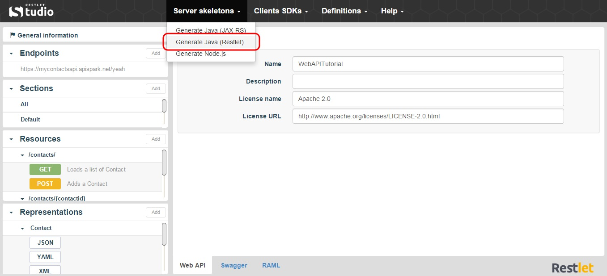

Restlet Studio provides you with the server code for your API. Your server skeleton is available in Java (following JAX-RS standard Framework or Restlet Framework) and JavaScript (Node.js). 

Restlet Framework is a lightweight, comprehensive, open source RESTful web API framework for the Java platform.

#Download Restlet Java server skeleton

1. Click on the **Server skeletons** menu and select **Generate Java (Restlet)**.

	

2. Download the .zip file that contains your Java server skeleton.