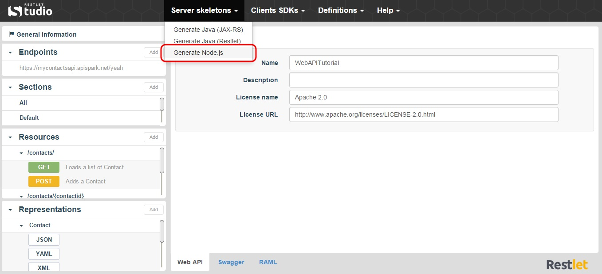

Restlet Studio provides you with the server code for your API. Your server skeleton is available in Java (following JAX-RS standard Framework or Restlet Framework) and JavaScript (Node.js). 

Node.js is a platform built on Chrome's JavaScript runtime to easily build fast, scalable network applications.

To download your Node.js server skeleton:

1. Click on the **Server skeletons** menu and select **Generate Node.js**.

	

2. Download the .zip file that contains your Node.js server skeleton.