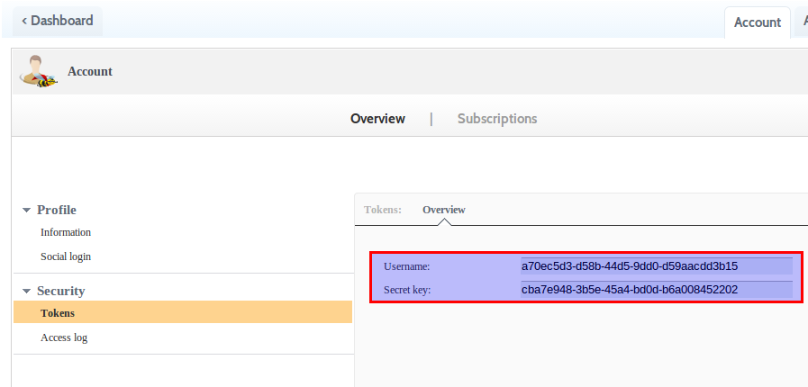

APISpark extension
==============

Introduction
============

This extension provides a tool to import the contract of your Restlet web API in 
the [APISpark](https://apispark.com/) full-stack PaaS for web APIs.

This will allow you to: 

-   Introspect you Restlet-based web API to retrieve documentation
-   Display and edit this documentation within APISpark
-   Synchronize web API changes initiated from Restlet

In this scenario, we’ll  load a WebAPI definition into APISpark. We’ll leverage the introspector tool provided in the APISpark extension. You can find a complete example of documentation generated via this extension here.
 
Launch process
==============

In this example, we’ll document a Web API whose Application class is MyContacts

    java -cp "/path/to/your/lib/*" org.restlet.ext.apispark.Introspector -u 55955e02-0e99-47f8 -p 6f3ee88e-8405-44c8 org.restlet.api.MyContacts
    
Configuration
-------------

You must add the following jars (provided in 
[restlet framework](http://restlet.org/download/current#release=stable&edition=jse&distribution=zip 
"download restlet framework")) 
in the "/path/to/your/lib" folder or manually to the classpath.

In Restlet framework lib directory:

-   org.restlet.jar (Restlet API)
-   org.restlet.ext.apispark.jar (Restlet APISpark extension with Introspector class)
-   org.restlet.ext.jackson.jar (Restlet Jackson extension)
-   org.restlet.ext.xml (Restlet xml extension in Restlet framework lib directory)
-   org.restlet.ext.wadl (Restlet xml extension in Restlet framework lib directory)

In Restlet framework lib/com.fasterxml.jackson_2.2/ directory:

-   com.fasterxml.jackson.annotations.jar
-   com.fasterxml.jackson.core.jar
-   com.fasterxml.jackson.csv.jar
-   com.fasterxml.jackson.databind.jar
-   com.fasterxml.jackson.smile.jar
-   com.fasterxml.jackson.xml.jar
-   com.fasterxml.jackson.yaml.jar

Your packaged web API:

-   org.restlet.api.jar (your packaged web API)

APISpark tokens
---------------
The parameters -u and -p are mandatory, they correspond to your APISpark user name and secret key. You can get those [here](https://apispark.com/account/overview) under the tab "tokens". You will need to [sign up](https://apispark.com/signin) first.

Load Web API definition into APISpark (first call)
----------------------------------------------------
 
Here is the result, we get from the Introspector:

    Process successfully achieved.
    Your Web API contract's id is: 246
    Your Web API documentation is accessible at this URL: https://apispark.com/apis/246/versions/1
 
 

Update your Web API definition (Subsequent calls )
--------------------------------------------------
 

Web API definition
------------------

You need to add a parameter -d giving the id of the definition, hosted on APISpark, that you want to update. You can find the parameter -d in two ways. 

-   It will be in the response body when you first use the extension on your API. 
-   If you did not write it down then you can go to your dashboard, click on the Web API Contract you want to update and get it from the URL. The URL should look like this: https://apispark.com/apis/[definition_id]/version/1/
 

Debug the Web API introspection
-------------------------------

If you want the introspector to display suggestions on how to improve your documentation, you can provide this parameter to the java command line:

    -Djava.util.logging.config.file="/path/to/logging/properties/logging.properties"

<!-- + EXAMPLE : properties file and logs-->
 
More about the Introspector Tool
--------------------------------
 
The Restlet extension for APISpark provides a source code introspector that takes a class (your Restlet class extending the class Application) from your web API as a parameter and instantiates its components to retrieve the contract of your API.

Here is its commande line help:

    SYNOPSIS
       org.restlet.ext.apispark.Introspector [options] APPLICATION
    DESCRIPTION
       Publish to the APISpark platform the description of your Web API,
       represented by APPLICATION, the full canonical name of your Restlet
       application class.
       If the whole process is successfull, it displays the url of the
       corresponding documentation.
    OPTIONS
       -h
              Prints this help.
       -u
              The mandatory APISpark user name.
       -p
              The mandatory APISpark user secret key.
       -s
              The optional APISpark platform URL (by default
              https://apispark.com).
       -c
              The optional full canonical name of your Restlet Component class.
              This allows to collect some other data, such as the endpoint.
       -d
              The optional id of an existing definition hosted by APISpark you
              want to update with this new documentation.
